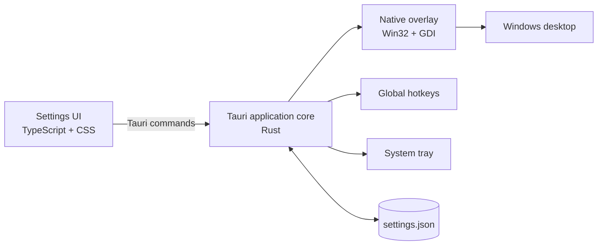

<div align="center">

# ◎ periScope

### Precision without the overhead.

A lightweight, deeply customizable crosshair overlay for Windows—powered by a
native Win32 renderer and a polished Tauri settings experience.

[](https://github.com/msugenius/periscope)
[](https://tauri.app/)
[](https://www.rust-lang.org/)
[](https://www.typescriptlang.org/)
[](https://github.com/msugenius/periscope)

</div>

---

periScope puts a clean, configurable crosshair above windowed and
borderless-fullscreen applications. Its overlay is a transparent, click-through
Win32 window that redraws only when settings or display configuration change—no
continuous animation loop and no unnecessary idle work.

> [!NOTE]
> periScope is in early development. The native overlay currently targets the
> primary monitor and is intended for windowed or borderless-fullscreen
> applications.

## Highlights

| | |
|---|---|
| **Native overlay** | Topmost, transparent, click-through Win32 rendering with per-pixel alpha |
| **Live customization** | Color, opacity, length, thickness, gap, outline, center dot, T-style, and X/Y offsets |
| **Quick shapes** | Start with Classic, Compact, Dot, Open, or Precision and fine-tune from there |
| **Light at idle** | Event-driven redraws instead of a permanent render loop |
| **Persistent settings** | Changes save automatically to the user's application configuration directory |
| **Global hotkeys** | Configurable system-wide shortcuts with validation, conflict handling, and safe rollback |
| **Tray-first operation** | Hide Settings and release its WebView while the native overlay and tray process remain active |

## Quick start

### Requirements

- Windows 10 or 11
- [Node.js](https://nodejs.org/) 20 or newer
- [Rust](https://rustup.rs/) stable with the MSVC toolchain
- Microsoft Edge WebView2 Runtime

### Run from source

```powershell
git clone https://github.com/msugenius/periscope.git
cd periscope
npm install
npm run tauri dev
```

### Build an installer

```powershell
npm run tauri build
```

Tauri writes release bundles beneath `src-tauri/target/release/bundle/`.

## Crosshair controls

| Group | Available controls |
|---|---|
| Geometry | Length, thickness, center gap |
| Appearance | Crosshair color, opacity, outline color, outline thickness |
| Shape | Center dot, dot size, T-style |
| Placement | Horizontal and vertical offsets |
| State | Enable/disable, center position, reset defaults |

Every value is validated by the Rust core before it reaches the native overlay
or persisted settings file.

## Global hotkeys

| Default | Action |
|:---:|---|
| <kbd>F3</kbd> | Close periScope completely, including the overlay and tray icon |
| <kbd>F4</kbd> | Open, restore, and focus Settings |

Use the **Hotkeys** page to record a key or key combination. Accepted changes
take effect immediately and survive restarts. Duplicate, invalid, or unavailable
shortcuts are rejected without replacing the previous working binding.
**Reset hotkeys** restores <kbd>F3</kbd>/<kbd>F4</kbd> without changing the
crosshair.

## How it works



- The framework-free TypeScript UI owns editing, preview, and shortcut capture.
- Rust validates settings, persists state, manages lifecycle, and coordinates
  native services.
- A dedicated Win32 message loop owns the layered overlay window.
- Settings changes post a redraw message; display and DPI changes trigger the
  same event-driven path.
- Closing Settings destroys the WebView window. The tray can recreate it on
  demand without interrupting the overlay.

## Project layout

```text
periScope/
├── src/                         # Framework-free TypeScript settings UI
│   ├── main.ts
│   └── styles.css
├── src-tauri/
│   ├── src/
│   │   ├── hotkeys.rs           # Registration, validation, and rollback
│   │   ├── overlay.rs           # Native layered Win32 renderer
│   │   ├── settings.rs          # Settings model and validation
│   │   ├── lib.rs               # Tauri commands, tray, persistence, lifecycle
│   │   └── main.rs
│   ├── capabilities/
│   ├── Cargo.toml
│   └── tauri.conf.json
├── specs/                       # Feature specifications and validation records
└── .specify/                    # Spec-driven development templates and tooling
```

## Development

| Command | Purpose |
|---|---|
| `npm run tauri dev` | Run the complete desktop application with live frontend reload |
| `npm run dev` | Run only the Vite frontend development server |
| `npm run build` | Type-check and create the production frontend bundle |
| `cargo test --manifest-path src-tauri/Cargo.toml` | Run Rust tests |
| `cargo fmt --manifest-path src-tauri/Cargo.toml -- --check` | Check Rust formatting |
| `npm run tauri build` | Build release installers |

Before opening a pull request, run:

```powershell
npm run build
cargo fmt --manifest-path src-tauri/Cargo.toml -- --check
cargo test --manifest-path src-tauri/Cargo.toml
```

## Engineering principles

periScope is governed by five intentionally strict values:

1. **Dead simple by default**
2. **Performance first**
3. **Lightweight footprint**
4. **Modular by design**
5. **KISS and DRY review discipline**

Changes must also maintain at least 80% line coverage for each instrumented
production codebase. See the
[project constitution](.specify/memory/constitution.md) for the complete quality
bar and exception policy.

## License

periScope is developed by [msugenius](https://github.com/msugenius) and
distributed under the [MIT License](LICENSE). You may use, copy, modify, merge,
publish, distribute, sublicense, and sell copies of the software, provided the
copyright and license notice are retained.

## Contributing

Issues and focused pull requests are welcome.

1. Check the existing [issues](https://github.com/msugenius/periscope/issues).
2. Keep each change small, independently understandable, and within the current
   Windows-focused scope.
3. Add or update tests for changed behavior.
4. Run the build, formatting, and test checks above.
5. Explain any new dependency, background work, or additional architectural
   complexity in the pull request.

<div align="center">

Built for a sharp aim and a quiet task manager.

</div>
